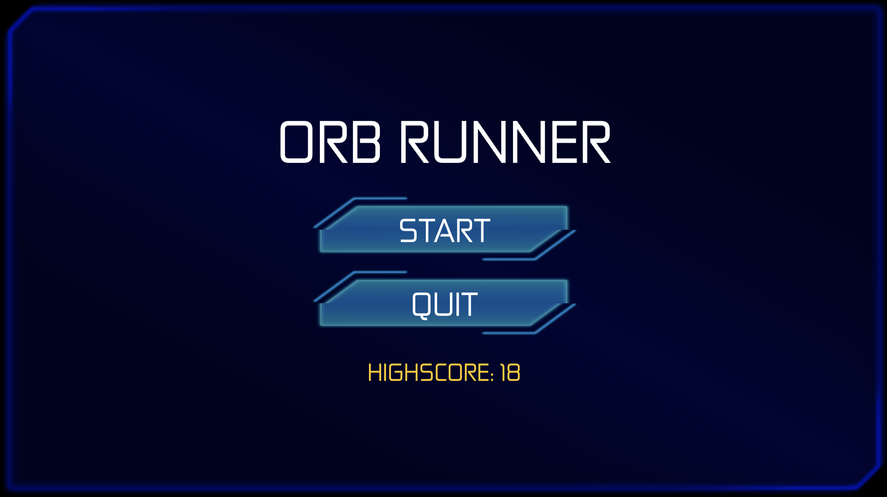
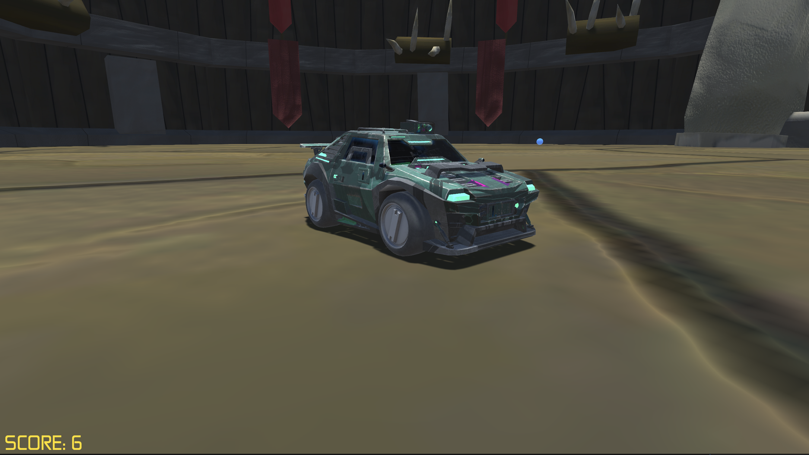
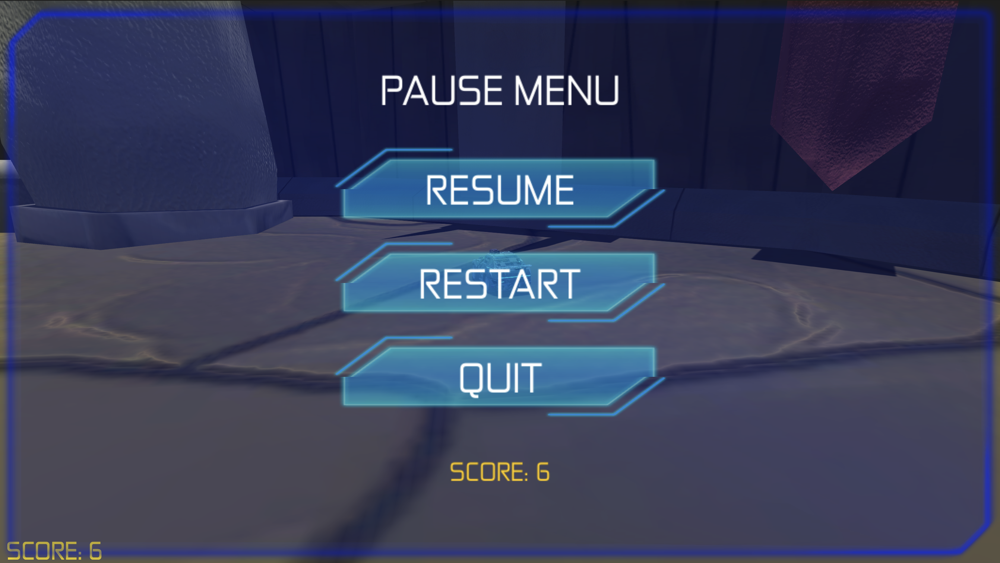
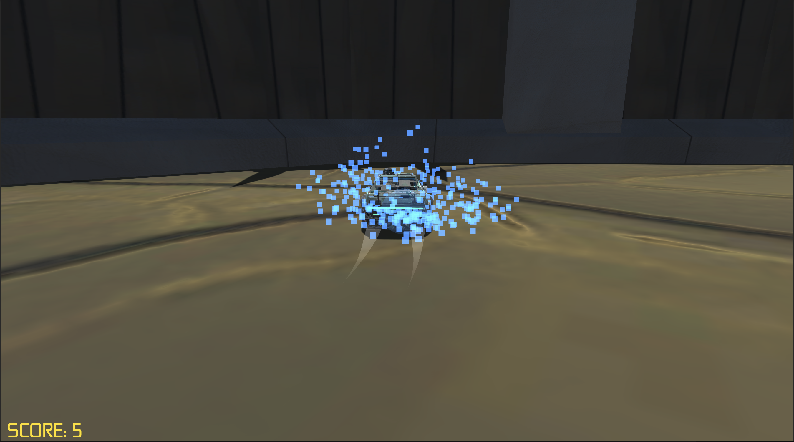

# Orb Runner

This is a highscore driven game built in unity to demonstrate a collision detection orbital camera and highscore data persistence system.

## Screenshots

 

 

 

## Notice

In order to see the UI in game you'll need to purchase the Sci-Fi UI unity asset from the unity asset store, as we use that to skin the UI menus and buttons.